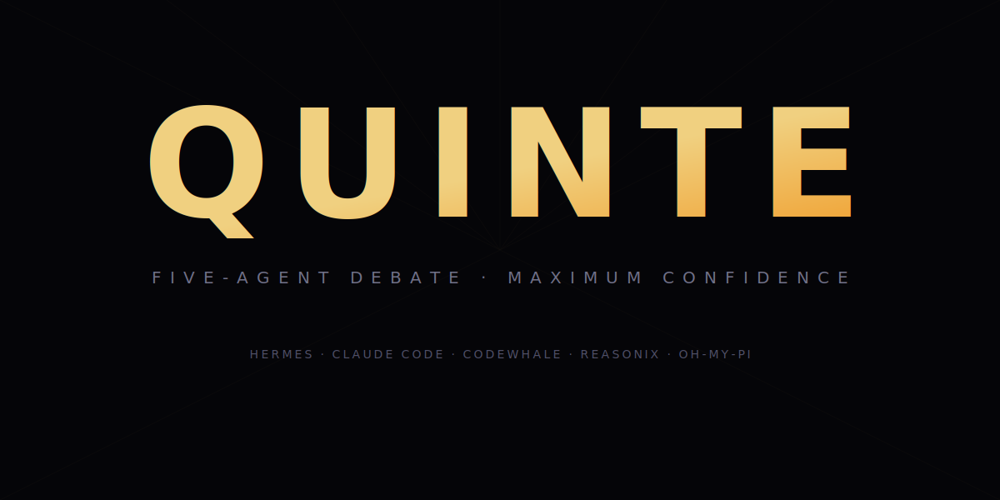

<div align="center">



# QUINTE

**Five-agent structured debate architecture for AI conclusion confidence.**

Single-model AI hits a confidence ceiling. QUINTE breaks through — five independent agents debate your questions through structured rounds of analysis, cross-examination, and final verdict.

---

[](https://deepseek.com)
[](https://deepseek.com)
[](https://deepseek.com)
[](LICENSE)

</div>

---

## Architecture

| Agent | Engine | R1 | R2 | Strengths |
|-------|--------|:--:|:--:|-----------|
| **Hermes** | DeepSeek v4-pro max | ✅ | ✅ | Orchestration + final verdict |
| **Claude Code** | DeepSeek v4-pro max | ✅ | ✅ | Broadest coverage, structured reporting |
| **CodeWhale** | DeepSeek v4-pro max | ✅ | ✅ | Deepest research, concurrency analysis |
| **Reasonix** | DeepSeek v4-pro max | — | ✅ | Pure reasoning judge (content-embedded) |
| **omp** | DeepSeek v4-pro xhigh | ⚡ | ✅ | Hot spare + cross-reviewer |

⚡ Activates if Claude Code times out (180s no output)

```
Round 1 — Independent     Round 2 — Cross-Review       Round 3
Hermes ──→ analysis       Hermes ──→ reviews all       Hermes ──→ verdict
Claude Code ──→ analysis  Claude Code ──→ reviews all
CodeWhale ──→ analysis    CodeWhale ──→ reviews all
(cc timeout → omp fills)  Reasonix ──→ pure judge
                           omp ──→ reviews all
```

## Design Principles

- **All DeepSeek v4-pro · reasoning=max · flash forbidden**
- **3 rounds max** — early consensus skips remaining rounds
- **≥2 parties** minimum — no single-agent decisions
- **Cross-review is adversarial** — review others, never yourself
- **Terminal + background CLI** — no delegate_task

## Quick Start

```bash
git clone https://github.com/eric-stone-plus/quinte.git
cd quinte
open quinte.html          # Architecture visualization
bash quinte-demo.sh       # Simulate a debate round
```

## Results

10+ debates conducted across code review, architecture decisions, naming conventions, and tool evaluation.

## License

MIT
