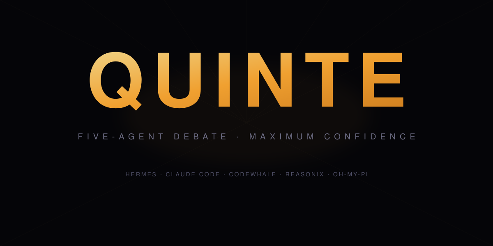

<div align="center">



# QUINTE

**A protocol-enforcing CLI for five-party adversarial review**

[](specs/PROTOCOL.md)
[](specs/CLI.md)
[](LICENSE)

</div>

QUINTE exposes disagreements, omissions, evidence gaps, and unresolved risk
before a host adopts a conclusion. It is not a generic agent delegator or an
answer-voting system.

The protocol has three rounds:

- **R1:** Party A-E produce independent analyses.
- **R2:** the same five parties cross-review anonymized R1 outputs.
- **R3:** the Primary Arbiter and the Counterpart Arbiter produce the dual verdict.

The Rust CLI owns the run state machine, fixed roster, typed output gates,
retry boundary, artifacts, and Primary Arbiter handshake. The host invokes the CLI; it
does not recreate QUINTE by launching the parties itself.

## Design Vocabulary

QUINTE names its two layers deliberately:

- **Scenario-oriented prompt layer.** The seven protocol roles are
  scripted scenario positions, not objects with encapsulated behavior. A role
  is a constructed situation — brief, evidence packet, output schema, and
  constraints — inside which a model improvises an analysis. The protocol does
  not program behavior; it stages situations and gates what returns.
- **Contract-oriented orchestration layer.** Everything outside the scenario —
  roster, rounds, state machine, typed output gates, retry boundary, and
  SHA-256 artifact bindings — is deterministic and closed-schema. Scenario
  text never advances the state machine; only typed artifacts do.

Object-oriented programming encapsulated behavior in objects. QUINTE induces
behavior in scenarios and arbitrates it with contracts.

## Runtime Boundary

Policy v2 binds all seven roles to one seat identity. The four binding axes
(`family`, `provider`, `text_model`, `multimodal_model`) must match exactly:

| Seat family | Adapter for Party A-E and both arbiters | Requirement |
| --- | --- | --- |
| MiMo | MiMoCode | isolated config/auth from selected Xiaomi key and base URL |
| DeepSeek | Reasonix | stateless provider config from selected DeepSeek key and base URL |
| OpenAI | Codex | relay must implement the Responses API |

Party A-E provide policy-defined scenario perspectives; they are not different
model families. Both R3 arbiters use the same seat family too. Cross-family
comparison belongs to an outer orchestrator such as MAGI, not one QUINTE run.
Legacy policy v1 remains readable without rewrite, but its historical native
harness roster is a compatibility surface, not the production v2 default. It
cannot start a new run; back up the file and run `quinte init --force` to
install a production v2 policy.

There is deliberately no command for running one party, skipping R2, replacing
a failed party, or asking a model to advance the state machine. A required lane
must produce closed-schema JSON on its assigned route or the phase does not
pass.

R2 is scheduler-serialized and paced: the default policy leaves at least ten
seconds between R2 transport starts. Trusted retry signals stay on the same
route and use a bounded attempt budget: host-observed timeouts, exact
rate-limit errors, MiMo's structured repetition-detector terminal error, and a
CodeWhale stream that reports both `completed` and `done` but contains no JSON
candidate or only a truncated final candidate. Backoff is bounded and
deterministically jittered, and persisted cooldowns prevent `resume` from
bypassing a wait.

Untrusted output text never controls retry behavior. Outside those exact
terminal signals, invalid UTF-8, JSON, or schema output is non-retryable; a
model merely mentioning `429`, timeout, or repetition is ordinary review
content. Output captured at a host timeout is accepted only when it is a
complete, strict LaneOutput whose `evidence_refs` and `closure_evidence` entries
are empty or exactly match snapshot refs in the run's snapshot manifest.

## Quick Start

For a stable host install, use the immutable GitHub Release for your platform
and verify its archive against the published `SHA256SUMS`. Build from source
when developing or when testing an unreleased `main` commit.

### macOS / Linux

```bash
git clone https://github.com/eric-stone-plus/QUINTE.git
cd QUINTE
cargo build --release

# 1) CLI on PATH (required)
install -m 0755 target/release/quinte ~/.local/bin/quinte
# ensure ~/.local/bin is on PATH

# 2) Host progress helpers (required for interactive agents / Hermes skill)
install -m 0755 scripts/quinte-progress scripts/quinte-run ~/.local/bin/
# or symlink so updates follow the checkout:
#   ln -sfn "$PWD/scripts/quinte-progress" ~/.local/bin/quinte-progress
#   ln -sfn "$PWD/scripts/quinte-run" ~/.local/bin/quinte-run

# 3) First-time state + environment check
quinte init    # first time only; creates ~/.quinte
quinte doctor  # after every install or rebuild
quinte --version
command -v quinte-progress quinte-run
```

### Windows (PowerShell)

```powershell
git clone https://github.com/eric-stone-plus/QUINTE.git
cd QUINTE
cargo build --release
$dir = Join-Path $env:LOCALAPPDATA "Programs\quinte\bin"
New-Item -ItemType Directory -Force -Path $dir | Out-Null
Copy-Item target\release\quinte.exe (Join-Path $dir "quinte.exe") -Force
Copy-Item scripts\quinte-progress, scripts\quinte-run $dir -Force
# add $dir to the user PATH, then open a new shell
quinte init
quinte doctor
```

### After every update

```bash
git pull
cargo build --release
install -m 0755 target/release/quinte ~/.local/bin/quinte   # or re-copy on Windows
# if you installed scripts by copy (not symlink), re-install them too
quinte doctor
```

### Host agent skill (Hermes and similar)

The durable skill lives in this repo at [`skills/SKILL.md`](skills/SKILL.md).
Copy or symlink it into the host’s live skill directory after install or pull
(for example Hermes technical profile
`…/skills/multi-agent-debate/quinte/SKILL.md`). Host trees under `~/.hermes`
are not version-controlled; **the repo file is the source of truth**.

Interactive hosts must not use `quinte run --wait` or bare `quinte wait`. Use
detached `quinte run --brief … --json` and poll `quinte-progress`, or stream
with `quinte-run --brief …`. Keep **one active run** at a time.

### Credentials and roster

The CLI is self-contained, but a production policy needs the matching adapter
and exactly one selected provider key/base URL pair. Set
`QUINTE_PROVIDER_KEY_ENV` and `QUINTE_PROVIDER_BASE_URL_ENV` to the appropriate
allowlisted names (`XIAOMI_*`, `DEEPSEEK_*`, or `OPENAI_*`). HTTPS is required;
whitespace and `.invalid` placeholders fail closed. `quinte doctor --json`
checks all seven roles before dispatch.

Create a brief such as `brief.json`:

```json
{
  "brief_version": "1.1",
  "question": "Which material risks remain in this change?",
  "context": "Review the implementation, tests, and operational boundary.",
  "evidence_roots": ["/absolute/path/to/project"],
  "snapshot_ignore": [".git", "build/**", "**/*.key"],
  "attachments": [],
  "action_scope": "decision support for this change only"
}
```

Start the run with machine-readable output:

```bash
quinte run --brief brief.json --json
```

The default command returns immediately with a queued run while a supervised
background worker advances R1, R2, both arbiters, and deterministic merge:

```json
{"cli_envelope_version":"1.0","ok":true,"data":{"run_id":"...","status":"queued","run_dir":"..."}}
```

Use `--wait` only for a human terminal that wants state observation (not worker
ownership). Production policy v2 requires `auto_primary_arbiter=true`, so a new
run normally returns `completed`. Historical runs created under policy v1 may
still expose:

```json
{"cli_envelope_version":"1.0","ok":true,"data":{"run_id":"...","status":"waiting_primary_arbiter","run_dir":"..."}}
```

`waiting_primary_arbiter` with exit code `0` is a historical/manual handoff,
not a completed verdict. Only for such an existing run, submit an external
verdict and inspect:

```bash
quinte primary-arbiter request RUN_ID --json
quinte primary-arbiter submit RUN_ID --verdict primary-arbiter-verdict.json --json
quinte inspect RUN_ID --json
```

`quinte wait RUN_ID` observes the same boundary. Ctrl-C interrupts only the
wait and leaves the background run active.

See [CLI.md](specs/CLI.md) for the complete command contract, Primary Arbiter response
schema, state transitions, exit codes, and artifact layout.

## State and Evidence

The default state root is `~/.quinte`:

```text
~/.quinte/
  policy.json
  runs/<run-id>/
    manifest.json
    events.jsonl
    input/
    lanes/
      <phase>/<route-id>/retry-deadline.json
    packets/
    r3/
    diagnostics/
      r2-rate-state.json
    result.json
    report.md
```

Inputs are copied into a per-run snapshot. Lane attempts retain their
invocation metadata, raw stdout/stderr, and accepted typed result. `result.json`
is the machine artifact; `report.md` is its human-readable rendering. Accepted
R1/R2 artifacts, the evidence packet, and the Counterpart Arbiter verdict are bound by an R3
input receipt before the Primary Arbiter sees the challenge. The final manifest also binds
`result.json` by SHA-256. Files are created as the run reaches each phase, so
failed or waiting runs are expected to have only a prefix of this layout.

Briefs may use `snapshot_ignore` to omit root-relative evidence paths with
portable `/`-separated glob patterns. For a single-file evidence root, its
filename is the relative path. A matched directory is pruned with all of its
contents; for example, `[".firecrawl", "tools/r4se-packages"]` omits both
trees. Built-in exclusions for credentials and common generated trees remain
in force.

Production v2 adapters receive validated attachments through their native
read-only input mechanisms. They start from a fresh per-attempt HOME/config
tree; selected provider state is constructed from the allowlisted environment
pair and no host agent profile is copied.

## Isolation and Authorization

The runtime uses per-lane working directories, isolated HOME/config directories,
cleared environments, adapter tool restrictions, output schemas, and process
tree supervision. These are process and configuration controls. **They are not
a kernel-enforced filesystem or network sandbox.** A child executable still
runs with the operating-system authority of the user who started QUINTE.

Do not treat process isolation as a containment boundary for an untrusted executable. Run
the CLI under an external sandbox, VM, container, or restricted OS account when
that threat model applies.

A QUINTE result is evidence, not authorization. It cannot authorize a push,
deletion, external write, or other protected action. The host and user retain
that authority.

## Repository Contracts

- [Protocol specification](specs/PROTOCOL.md) defines the debate invariants.
- [CLI specification](specs/CLI.md) defines the executable boundary.
- [Windows PowerShell development log](docs/windows-powershell-development-log.md)
  records the native process-launch design and regression boundary.
- [JSON schemas](schemas/) define accepted brief, lane, primary-arbiter response, result,
  and compatibility artifacts.
- [QUINTE skill](skills/SKILL.md) is a thin host entry point to the CLI.

## License

MIT. Host-bound tools and model services retain their own licenses and terms.
