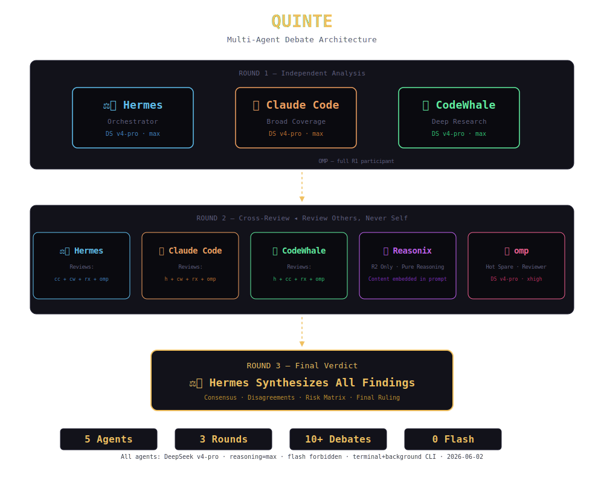

# QUINTE — Multi-Agent Debate Architecture

> **⚠️ This standalone skill has been absorbed into `multi-agent-debate` as of 2026-06-03.**
> The full protocol, 5-agent architecture, invocation details, and known pitfalls now live in the `multi-agent-debate` skill.
> This repo is retained as a reference for the QUINTE architecture diagram and demo assets.

## Architecture

## Participation

| Agent | Engine | R1 | R2 | Role |
|-------|--------|:--:|:--:|------|
| Hermes (hm) | v4-pro · xhigh | ✅ | ✅ | Orchestrator + final verdict |
| Claude Code (cc) | v4-pro · max | ✅ | ✅ | Broadest coverage, structured reports |
| CodeWhale (cw) | v4-pro · max | ✅ | ✅ | Deepest research, concurrency analysis |
| OMP | v4-pro · xhigh | ✅ | ✅ | Full participant, all rounds |
| Reasonix (rx) | v4-pro · max | — | ✅ | R2 pure reasoning judge |

⛔ rx 绝不参与 R1 — run 模式不执行工具。

**All DeepSeek v4-pro. Hermes/OMP xhigh, rest max. No flash degradation. Token budget unlimited.**

**R1: 4 agents. R2: 5 agents (Reasonix joins).** When Reasonix run mode supports tool calls, R1 expands to 5.

**No degradation:** all 5 must participate. Timeout → retry with smaller prOMPt, never skip.

## Key Updates

- **2026-06-03 v2.2**: hm/rx shorthands added, rx R1 prohibition, execution discipline
- **2026-06-03 v2.1**: OMP promoted from hot spare to full R1 participant. Architecture: R1=4 agents, R2=5.
- **2026-06-03 v2.0**: Skill absorbed into `multi-agent-debate`. `oh-my-pi` → `OMP` naming standardized. No-degradation policy.

## See Also

- `SKILL.md` in this repo — the full QUINTE architecture reference
- `multi-agent-debate` skill — full protocol, triggers, invocation, pitfalls (available in Hermes Agent skill registry)
